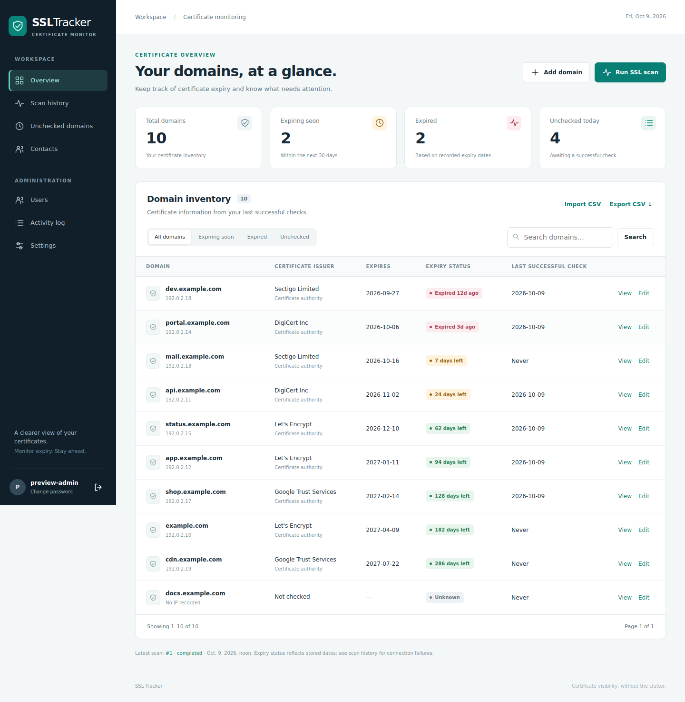

# SSL Tracker

A Django application for keeping track of TLS certificates, expiry dates, and the people responsible for them. Scans run in a separate background worker, so the interface stays responsive while domains are checked.

- Domain overview with expiry filters and search.
- Background scans with progress, history, and failure details.
- A shared database lock prevents overlapping scans.
- Contact assignments, CSV import/export, and role-based access.
- Direct network connections for TLS checks and optional HTTP integrations.

## Interface



The screenshot uses example data. A mobile screenshot is included in `docs/interface-mobile.png`.

## Requirements

These instructions target **Ubuntu 24.04 LTS**, Python **3.12**, and systemd. Other Linux distributions require equivalent packages and adjusted nginx paths. The application targets Django **5.2**; install the supplied requirements in a virtual environment. Older Django releases cannot load this version's constraints.

SQLite is the database in this version. Keep the web service, worker, and database on the same host. Larger deployments may need a separately planned database migration; do not put the SQLite file on a network share.

## Local Linux installation

Extract the source archive, then enter the directory containing `manage.py`:

```bash
sudo apt update
sudo apt install python3 python3-venv python3-pip ca-certificates
cd ssltracker
python3 -m venv .venv
source .venv/bin/activate
python -m pip install -r requirements.txt
python -m django --version
python manage.py migrate
python manage.py createsuperuser
python manage.py runserver 127.0.0.1:8000
```

The Django version should be `5.2.x`. Open <http://127.0.0.1:8000/>. In a second terminal, from the same project directory:

```bash
source .venv/bin/activate
python manage.py ssl_worker
```

Leave both processes running. The website queues work; the worker performs it. A queued scan will wait until a worker is available. You do not need `makemigrations` for installation: migration files are included.

The database defaults to `db.sqlite3` beside `manage.py`. No credentials or pre-populated database are required for a new installation. The local development server is not for public hosting.

## Install as Linux services

The following example uses `/opt/ssltracker` for application code and `/var/lib/ssltracker` for the database. Run these steps from the extracted directory containing `manage.py`. If upgrading an existing installation, read **Updating an existing installation** first.

### 1. Create a service account and install the application

```bash
sudo apt install nginx python3-venv ca-certificates
sudo useradd --system --user-group --home-dir /opt/ssltracker --shell /usr/sbin/nologin ssltracker
sudo install -d -o ssltracker -g ssltracker -m 755 /opt/ssltracker
sudo install -d -o ssltracker -g ssltracker -m 750 /var/lib/ssltracker
sudo cp -a . /opt/ssltracker/
sudo chown -R ssltracker:ssltracker /opt/ssltracker
sudo -u ssltracker python3 -m venv /opt/ssltracker/.venv
sudo -u ssltracker /opt/ssltracker/.venv/bin/python -m pip install -r /opt/ssltracker/requirements.txt
sudo -u ssltracker /opt/ssltracker/.venv/bin/python -m pip install gunicorn
```

Use a clean source directory, without a development `.venv` or database, for the copy step. If the account already exists, skip `useradd`.

### 2. Configure the environment

```bash
sudo install -o root -g ssltracker -m 640 deploy/ssltracker.env.example /etc/ssltracker.env
/opt/ssltracker/.venv/bin/python -c "import secrets; print(secrets.token_urlsafe(48))"
sudoedit /etc/ssltracker.env
```

Use the generated value for `DJANGO_SECRET_KEY`. Replace `monitor.example.com` in both hostname settings with your actual hostname. Keep this environment file private. It contains configuration shared by the web service, worker, and scheduler. The application does not automatically read `.env` files; systemd loads `/etc/ssltracker.env`.

### 3. Initialize the database and static assets

```bash
sudo -u ssltracker /bin/bash -c 'set -a; source /etc/ssltracker.env; set +a; cd /opt/ssltracker; .venv/bin/python manage.py migrate && .venv/bin/python manage.py createsuperuser && .venv/bin/python manage.py collectstatic --noinput'
```

For an existing database, skip `createsuperuser` if you already have an administrator. New styles and scripts are bundled locally; no external font or Bootstrap CDN is needed for the application interface.

### 4. Start the web service and worker

```bash
sudo cp deploy/ssltracker-web.service deploy/ssltracker-worker.service /etc/systemd/system/
sudo systemctl daemon-reload
sudo systemctl enable --now ssltracker-web ssltracker-worker
sudo systemctl status ssltracker-web ssltracker-worker
```

Logs:

```bash
sudo journalctl -u ssltracker-web -u ssltracker-worker -f
```

### 5. Configure nginx and HTTPS

Edit `deploy/nginx.conf` and replace `monitor.example.com` with your hostname:

```bash
sudo cp deploy/nginx.conf /etc/nginx/sites-available/ssltracker
sudo ln -s /etc/nginx/sites-available/ssltracker /etc/nginx/sites-enabled/ssltracker
sudo nginx -t
sudo systemctl reload nginx
```

The included nginx configuration routes incoming web requests to Gunicorn and serves collected static assets. It does not route outgoing certificate checks.

For a public hostname whose DNS points at this server, install an HTTPS certificate before users sign in:

```bash
sudo apt install certbot python3-certbot-nginx
sudo certbot --nginx -d monitor.example.com
```

Ports 80 and 443 must be reachable for the HTTP challenge and normal service. Replace the example hostname. Internal-only installations should use their organization's HTTPS certificate procedure instead.

After HTTPS is working, set `DJANGO_HTTPS=1` in `/etc/ssltracker.env`, keep the trusted origin set to the HTTPS URL, and restart:

```bash
sudo systemctl restart ssltracker-web ssltracker-worker
```

This enables secure cookies and HTTPS redirection. Enable it only with the supplied nginx forwarded-scheme handling (or equivalent trusted front-end configuration). Keep Gunicorn bound to loopback.

## Configuration reference

| Environment variable | Default | Purpose |
| --- | --- | --- |
| `SSLTRACKER_DB_PATH` | `BASE_DIR/db.sqlite3` | SQLite database file; both services must use the same absolute path |
| `SSL_SCAN_WORKERS` | `8` | Simultaneous domain probes, from 1 to 32 |
| `SSL_CONNECT_TIMEOUT` | `5` | Socket timeout in seconds |
| `SSL_DOMAIN_TIMEOUT` | `30` | Whole-domain deadline, including DNS and all configured ports |
| `SSL_CA_FILE` | empty | Optional PEM CA trust bundle for internal TLS certificates |
| `SSL_DIGICERT_SYNC` | `0` | Opt into the legacy DigiCert inventory integration |
| `MS_GRAPH_SENDER` | empty | Sender mailbox used by optional Graph expiry notifications |
| `DJANGO_DEBUG` | `1` | Development only; set `0` on a server |
| `DJANGO_SECRET_KEY` | development placeholder | Set a unique generated secret for production |
| `DJANGO_ALLOWED_HOSTS` | `127.0.0.1,localhost` | Comma-separated hostnames, without URL schemes |
| `DJANGO_CSRF_TRUSTED_ORIGINS` | empty | Comma-separated trusted origins, including HTTPS scheme |
| `DJANGO_HTTPS` | `0` | Enable HTTPS redirection and secure cookies behind the configured nginx front end |

Configure scan ports and reminder days in **Settings** as comma-separated values, for example `443,8443` and `5,15,30`.

All outgoing application connections are direct. Older outbound intermediary settings are no longer used. TLS certificate verification remains enabled. For internal domains, install the appropriate root CA or set `SSL_CA_FILE` in the worker environment. HTTP integrations use the Requests default CA bundle; for a private HTTP integration, configure a trusted CA explicitly in that integration rather than relying on environment interception.

## Schedule scans

The worker must run continuously. The included systemd timer queues one scan daily at **05:00 in the server's timezone**. This may differ from Django's display timezone.

```bash
sudo cp deploy/ssltracker-scan.service deploy/ssltracker-scan.timer /etc/systemd/system/
sudo systemctl daemon-reload
sudo systemctl enable --now ssltracker-scan.timer
sudo systemctl list-timers ssltracker-scan.timer
```

To change the time, edit `OnCalendar` in the timer unit, reload systemd, and restart the timer. `Persistent=true` queues a missed run after the server starts.

To queue a scan manually using the service environment:

```bash
sudo systemctl start ssltracker-scan.service
```

For local development, use `python manage.py queue_ssl_scan`, or add `--unchecked` for only domains not successfully checked today. A request made during an active scan joins the existing run; it does not queue another run afterward.

## Recover an interrupted scan

Queued jobs can be claimed when the worker starts. A running job whose worker crashes stays locked so that a paused worker cannot resume on top of a new run.

1. Stop the timer and **all** worker instances; confirm their probe processes have also exited:
   `sudo systemctl stop ssltracker-scan.timer ssltracker-worker`.
2. Find the abandoned scan ID in **Scan history**.
3. Replace `RUN_ID` below:

```bash
sudo -u ssltracker /bin/bash -c 'set -a; source /etc/ssltracker.env; set +a; cd /opt/ssltracker; .venv/bin/python manage.py recover_ssl_scan RUN_ID --workers-stopped'
sudo systemctl start ssltracker-worker ssltracker-scan.timer
sudo systemctl start ssltracker-scan.service
```

The flag is an operator assertion, not an automatic process check. Stop any manually started workers as well. Previously saved results remain available. Recovery releases the abandoned run; it does not resume its unfinished items automatically.

## Updating an existing installation

- Back up the application, environment file, and SQLite database. Stop web, worker, and timer services before copying a SQLite file or replacing code.
- Keep your existing database. This source update does not include a database. Point `SSLTRACKER_DB_PATH` to it; if moving to `/var/lib/ssltracker`, copy the database there while services are stopped and give the service account ownership. Do not accidentally initialize a new empty database instead.
- Install updated requirements in the virtual environment, run `migrate`, and run `collectstatic --noinput` to publish the new interface assets.
- Old outgoing connection settings can be removed from your environment. The PySocks dependency is no longer required.
- If upgrading from the original scheduled scripts, remove their old cron entries and use only the new scan queue timer.
- Restart services and verify a small scan. No database schema changes were introduced by the interface/direct-connection update.

## Roles and daily use

**Admins** and superusers can manage users, integrations, imports, exports, and activity logs. **Dashboard** users can manage domains/contacts, run scans, and send configured reminders. **Readers** can view domains, contacts, and scan history.

Add actual hostnames such as `example.com`; do not include `https://` or wildcard names. The first successfully validated configured port supplies the certificate; this schema tracks one certificate per domain. Certificate expiry badges are calculated from stored expiry dates, not live TLS state. Failed checks retain previous certificate data and appear in **Scan history**.

## Optional integrations and limitations

DigiCert is not required for direct SSL scanning. The legacy inventory importer rejects a full 100-record response rather than silently replacing inventory with an incomplete page. Complete pagination still needs the exact legacy API contract. Existing domains continue to be checked when an optional sync fails. Keep `SSL_DIGICERT_SYNC=0` unless you need the integration and have configured it.

Microsoft Graph notifications require application credentials, the required tenant permissions, and `MS_GRAPH_SENDER`. Notifications are manually triggered, run in the web request, and still use stored reminder-day values; automatic retries/idempotency and recalculation of those legacy email counters are not implemented. No messages are sent simply by running a scan.

## Checks and tests

```bash
source .venv/bin/activate
python manage.py check
python manage.py makemigrations --check --dry-run
python manage.py test ssltracker
python tests_concurrency.py
```

The tests use disposable data; the local TLS fixture needs `openssl`. The concurrency script checks competing queue requests and worker claims in separate processes. `requirements.lock.txt` records the exact tested application dependencies; Gunicorn is installed separately for production.

Deployment references: [Django deployment](https://docs.djangoproject.com/en/5.2/howto/deployment/), [Gunicorn with Django](https://docs.djangoproject.com/en/5.2/howto/deployment/wsgi/gunicorn/), and [static files](https://docs.djangoproject.com/en/5.2/howto/static-files/deployment/).
